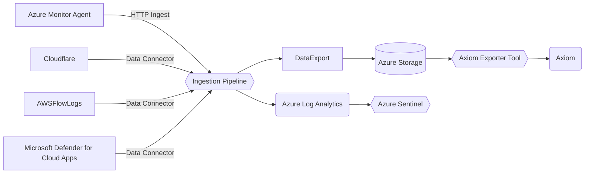
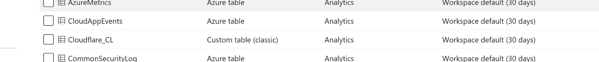
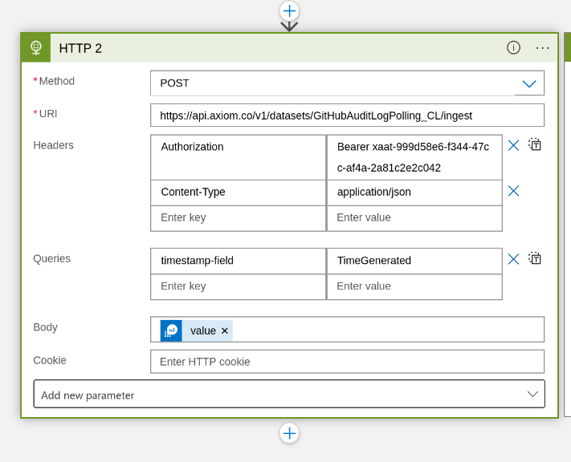

The Azure Sentinel => Axiom exporter is built around the Azure Log Analytics Data Exporter feature set. Azure Sentinel is built on-top of Azure Log Analytics so all the data in Sentinel can be found there too. 

At a high level, Log Analytics Data Export will continuously export rows that are ingested into Azure Tables into Azure Storage blobs. 

These blobs are then read by the exporter tool, which can then forward the rows to axiom for long term storage, then finally deleting the Azure Storage blob that was exported as it is no longer needed. 

# Continuous Data Export setup
## Setup a Unique Azure Storage Account
>[!warning]
>The tool *will* delete blobs in the storage account you setup after exporting said blob into axiom. Do not share this storage account with other export uses.   
referencing [this article](https://learn.microsoft.com/en-gb/azure/azure-monitor/logs/logs-data-export?tabs=portal#storage-account) you will need to setup a unique storage account to export your Log Analytics tables into. 
There are some requirements that the Storage Account must match
- Destinations must be in the same region as the Log Analytics workspace.
- The Storage Account must be unique across rules in the workspace.
- Export to Premium Storage Account isn't supported.
- The Storage Account must be StorageV1 or later.

## Setup a Log Analytics Data Export Rule
Referencing [this article](https://learn.microsoft.com/en-gb/azure/azure-monitor/logs/logs-data-export?tabs=portal#create-or-update-a-data-export-rule) you must create a data export rule to export the tables you select into the given storage account as blob storage. 
This is where you will select the tables you want to export, any tables not selected here will not be exported. All tables you select here will be exported by the export tool.
> [!note] 
>any _new_ tables you want to export will need to be added to this rule. It will not automatically pick up new tables.

## Setup an Axiom Personal Access Token 
>[!warning] 
>Personal access tokens allow access to any organisation and has all the permissions that your user has. 
API Token support is coming soon, but for testing a Personal Access Token may be used. 

## Deploy the Azure Sentinel Exporter tool 

The Azure Sentinel Exporter tool is available as a docker container that may be deployed in a variety of ways.

The favoured way is to deploy the tool into Azure Container Instances, when creating the container set the `Image Source` to `Other Registry` then set the Image to 
> ghcr.io/axiomhq/sentinel-sync:main

With the OS type set to linux. 

In the Advanced tab you should be sure to set a few required environment variables: 
- `STORAGE_URL`: the storage url of your storage account, something like `https://${yourstoragename}.blob.core.windows.net/`
- `CONNECTION_STRING`: the connection string to access your storage account 
- `AXIOM_PERSONAL_TOKEN`: the string for the personal access token you created to export 
- `AXIOM_ORG`: the orginsation ID of your axiom account (if using a personal access token)
	
# Azure Tables vs Custom Legacy Tables

Only Azure Tables can be exported by the Log Analytics Data Export, Custom (legacy) tables are not supported (for a full list see [this article](https://learn.microsoft.com/en-us/azure/azure-monitor/logs/tables-feature-support)) 

## Custom Legacy Table Exporting
Custom (legacy) tables can still be exported to axiom, but must go via the less efficient and more restricted Logic Apps mechanism to run periodic queries against your custom tables, which then egress the results to axiom. See [this article](https://learn.microsoft.com/en-us/azure/azure-monitor/logs/logs-export-logic-app) on exporting logs via logic apps

When creating your logic-app to export your custom tables, you will need to setup a HTTP action that is configured like so:
 

- Method: `POST`
- URI: `https://api.axiom.co/v1/datasets/${YOUR_DATASET_NAME}/ingest`
- Headers:
  - `Authorization`: `Bearer ${YOUR INGEST API KEY}`
  - `Content-Type`: `application/json`
- Queries:
   - `timestamp-field`: `TimeGenerated` 
- Body: set to the value of the query result 

This setup will send the json array of results from your query to axiom as a json array. the `timestamp-field` is used to inform axiom that the TimeGenerated field can be mapped to `_time`. 

In addition, the Datasets matching the Tables you are exporting *must* already exist in axiom, otherwise a 404 will be returned when you run the logic app

In addition, note that because of the nature of logic apps, 100% of your data is not guaranteed as logic apps have their own query/result limits that may stop all results for very large tables being returned. 
